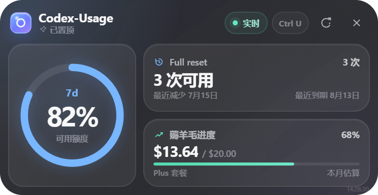

# Codex-Usage

一个简洁的 Codex 用量桌面小组件。

[](https://github.com/Oblivionis-ling/Codex-Usage/releases/latest)
[](https://github.com/Oblivionis-ling/Codex-Usage/releases/latest)
[](LICENSE)

[下载最新版](https://github.com/Oblivionis-ling/Codex-Usage/releases/latest) · [下载一键安装脚本](https://github.com/Oblivionis-ling/Codex-Usage/raw/refs/heads/main/install.cmd) · [English](#english)



## 功能

- 用圆环显示当前 Codex 可用额度；当服务端不再提供 5h 窗口时，自动显示仍可用的额度窗口。
- 显示 OpenAI 发放的 Full reset 可用次数、最近减少日期和最近一项到期日期。
- 显示套餐回本进度：本月本地用量的 API 等效价值 / 套餐价格。界面当前仍显示“薅羊毛进度”。
- 窗口可见时每 15 秒刷新，也可以通过窗口或托盘立即刷新。
- 默认置顶；使用 `Ctrl+U` 全局快捷键打开或隐藏窗口。
- 无边框紧凑窗口、系统托盘控制和深色简约界面。

## 一键安装

支持 Windows 10/11 x64，不需要管理员权限。

1. 下载 [`install.cmd`](https://github.com/Oblivionis-ling/Codex-Usage/raw/refs/heads/main/install.cmd)。
2. 双击运行。

脚本会自动下载最新 Release、校验 SHA256、安装到 `%LOCALAPPDATA%\Codex-Usage`、创建桌面快捷方式并启动应用。默认不会加入开机启动。首次从旧版迁移时，脚本会复制原有的套餐价格和 Full reset 历史，不会修改或删除旧版程序。

也可以在 PowerShell 中运行：

```powershell
irm https://github.com/Oblivionis-ling/Codex-Usage/raw/refs/heads/main/install.cmd -OutFile "$env:TEMP\install-codex-usage.cmd"
& "$env:TEMP\install-codex-usage.cmd"
```

如果 Windows SmartScreen 提示“Windows 已保护你的电脑”，请先确认文件来自本仓库，再选择“更多信息” → “仍要运行”。当前发布文件尚未进行商业代码签名。

### 手动使用

也可以从 [Releases](https://github.com/Oblivionis-ling/Codex-Usage/releases/latest) 下载 `Codex-Usage-*-portable.exe`，放到任意目录直接运行。发布页同时提供 `SHA256SUMS.txt`。

## 使用方法

- 请先在本机登录 Codex。应用会复用 `~/.codex` 中的本地登录状态。
- 单击托盘图标或按 `Ctrl+U` 打开/隐藏组件。
- 点击窗口右上角刷新按钮，或在托盘菜单中选择“刷新数据”。
- 在托盘菜单中设置套餐价格。识别到 Plus、Pro、Team 或 Business 时会使用内置参考价格，也可以选择 `$20`、`$30`、`$100` 或 `$200`。
- 点击窗口关闭按钮只会隐藏组件；需要完全退出时，请在托盘菜单中选择“退出”。
- 置顶默认开启，可以在托盘菜单中切换。

## 数据来源与隐私

Codex-Usage 的数据处理均在本机完成：

- 通过随应用打包的 Codex CLI `app-server` 读取账户套餐和服务端返回的额度窗口。
- 读取 `~/.codex/sessions` 与 `~/.codex/archived_sessions` 中的本地 `token_count` 事件，估算本月 API 等效价值。
- Full reset 次数来自 Codex `app-server`；到期明细使用本机 Codex 登录信息，只读请求 OpenAI 的 `chatgpt.com` 服务。
- 登录令牌不会写入日志、界面或项目自己的配置文件，也不会发送给第三方服务器。
- 应用只在用户数据目录保存套餐价格、窗口偏好和 Full reset 变化历史。

“套餐回本进度”是根据本地 token 事件和项目内价格表计算的估算值，不是 OpenAI 账单，也不代表实际支出或退款金额。未识别模型的 token 会统计用量，但不会计入等效价值。

## Full reset 兼容性

Full reset 的可用次数来自 Codex 的账户额度响应；最近到期日期来自 OpenAI 桌面端使用的内部接口。该接口没有公开稳定性承诺，未来可能变更或暂时不可用。

如果到期明细无法读取，应用会继续显示可用次数，并将日期显示为“有效期暂不可用”。这通常不代表 Full reset 次数已经失效。

## 更新与卸载

更新时重新运行最新版 `install.cmd` 即可。脚本会校验下载文件、关闭已安装的 Codex-Usage 进程、替换程序并重新启动；不会启用开机启动。

卸载步骤：

1. 在托盘菜单中退出 Codex-Usage。
2. 删除 `%LOCALAPPDATA%\Codex-Usage`。
3. 删除桌面的 `Codex-Usage` 快捷方式。
4. 如需同时删除设置和 Full reset 历史，再删除 `%APPDATA%\Codex-Usage`。

## 常见问题

### 为什么只显示 7d 额度，没有 5h？

Codex 已不再为部分账户返回 5h 额度。应用不会伪造缺失的数据，而是显示服务端仍提供的额度窗口。

### 为什么 Full reset 有次数，但没有到期日期？

次数和到期明细来自不同响应。登录状态过期、网络问题或 OpenAI 内部接口变化，都可能使到期日期暂时不可用。请先确认 Codex 已登录，再手动刷新。

### 为什么套餐回本进度和账单不一致？

它使用本地会话中的 token 事件和 API 参考价格进行估算，不包含所有可能的计费规则，也不是官方账单。请在托盘中确认套餐价格是否正确。

### 为什么按 `Ctrl+U` 没有反应？

其他应用可能已经占用该全局快捷键。退出占用快捷键的应用后，重新启动 Codex-Usage。

## 开发与构建

需要 Node.js 24 和 pnpm 11。

```bash
pnpm install
pnpm dev
```

常用命令：

```bash
pnpm test       # 单元测试
pnpm run check  # ESLint、Prettier 和单元测试
pnpm dist       # 构建 Windows 便携版
```

构建产物位于 `dist/`，不会提交到 Git 仓库；正式安装包只作为 GitHub Release 附件发布。

## License

[MIT](LICENSE)

Codex-Usage 是社区项目，不是 OpenAI 官方产品。

---

<a id="english"></a>

## English

A compact desktop widget for Codex usage.

[Download the latest release](https://github.com/Oblivionis-ling/Codex-Usage/releases/latest) · [Download the one-click installer](https://github.com/Oblivionis-ling/Codex-Usage/raw/refs/heads/main/install.cmd)

## Features

- Shows the current Codex allowance as a ring. If the service no longer returns a 5h window, the app displays the remaining available window.
- Shows OpenAI Full reset credits, the most recent decrease date, and the nearest credit expiration date.
- Tracks subscription value: estimated API-equivalent usage for the current month divided by the subscription price. The current UI label remains “薅羊毛进度”.
- Refreshes every 15 seconds while visible, with manual refresh controls in the widget and tray.
- Stays on top by default and uses the global `Ctrl+U` shortcut to show or hide the widget.
- Provides a compact frameless window, tray controls, and a restrained dark interface.

## One-click installation

Codex-Usage supports 64-bit Windows 10 and Windows 11. Administrator access is not required.

1. Download [`install.cmd`](https://github.com/Oblivionis-ling/Codex-Usage/raw/refs/heads/main/install.cmd).
2. Double-click it.

The script downloads the newest release, verifies its SHA256 checksum, installs it to `%LOCALAPPDATA%\Codex-Usage`, creates a desktop shortcut, and launches the app. It does not enable startup launch. On the first migration, it copies the previous subscription price and Full reset history without modifying or deleting the old app.

PowerShell alternative:

```powershell
irm https://github.com/Oblivionis-ling/Codex-Usage/raw/refs/heads/main/install.cmd -OutFile "$env:TEMP\install-codex-usage.cmd"
& "$env:TEMP\install-codex-usage.cmd"
```

The release is not commercially code-signed yet. If SmartScreen appears, verify that the file came from this repository before choosing “More info” → “Run anyway”.

### Portable download

You can also download `Codex-Usage-*-portable.exe` and `SHA256SUMS.txt` from [Releases](https://github.com/Oblivionis-ling/Codex-Usage/releases/latest), then run the executable from any folder.

## Usage

- Sign in to Codex on this computer first. The app reuses the local sign-in stored under `~/.codex`.
- Click the tray icon or press `Ctrl+U` to show or hide the widget.
- Use the refresh button or choose “刷新数据” from the tray menu to refresh immediately.
- Set the subscription price from the tray menu. Recognized Plus, Pro, Team, and Business plans use built-in reference prices, or you can select `$20`, `$30`, `$100`, or `$200`.
- The close button hides the widget. Choose “退出” from the tray menu to quit it completely.
- Always-on-top is enabled by default and can be toggled from the tray menu.

## Data and privacy

Codex-Usage processes its data locally:

- The bundled Codex CLI `app-server` provides the account plan and server-returned allowance windows.
- Local `token_count` events under `~/.codex/sessions` and `~/.codex/archived_sessions` are used to estimate API-equivalent usage for the current month.
- Full reset counts come from Codex `app-server`. Expiration details are fetched read-only from OpenAI's `chatgpt.com` service using the local Codex sign-in.
- Sign-in tokens are never written to logs, rendered in the UI, saved in the app's own settings, or sent to third-party servers.
- Only the subscription price, window preferences, and Full reset history are stored in the app data directory.

Subscription value is an estimate based on local token events and the price table included in this project. It is not an OpenAI bill and does not represent actual charges or refunds. Tokens from unrecognized models are counted but excluded from the value estimate.

## Full reset compatibility

The Full reset count comes from the Codex account allowance response. The nearest expiration date comes from an internal endpoint used by OpenAI's desktop client. That endpoint has no public stability guarantee and may change or become temporarily unavailable.

When expiration details cannot be read, the app keeps showing the available count and marks the date as unavailable.

## Update and uninstall

Run the latest `install.cmd` again to update. It verifies the download, closes the installed Codex-Usage process, replaces the executable, and restarts the app without enabling startup launch.

To uninstall:

1. Quit Codex-Usage from the tray menu.
2. Delete `%LOCALAPPDATA%\Codex-Usage`.
3. Delete the `Codex-Usage` desktop shortcut.
4. Optionally delete `%APPDATA%\Codex-Usage` to remove preferences and Full reset history.

## FAQ

### Why is there a 7d allowance but no 5h allowance?

Codex no longer returns a 5h allowance for some accounts. The app shows only windows returned by the service and does not invent missing data.

### Why can I see Full reset credits but no expiration date?

The count and expiration details come from different responses. An expired sign-in, a network problem, or a change to OpenAI's internal endpoint can make expiration details temporarily unavailable. Confirm that Codex is signed in, then refresh manually.

### Why does subscription value differ from my bill?

It is an estimate based on local token events and reference API pricing, not an official bill. Confirm the subscription price in the tray menu.

### Why does `Ctrl+U` not work?

Another application may already own the global shortcut. Close that application and restart Codex-Usage.

## Development

Node.js 24 and pnpm 11 are required.

```bash
pnpm install
pnpm dev
```

```bash
pnpm test       # Unit tests
pnpm run check  # ESLint, Prettier, and unit tests
pnpm dist       # Build the Windows portable executable
```

Build output is written to `dist/` and is never committed to the repository. Published binaries are attached only to GitHub Releases.

## License

[MIT](LICENSE)

Codex-Usage is a community project and is not an official OpenAI product.
